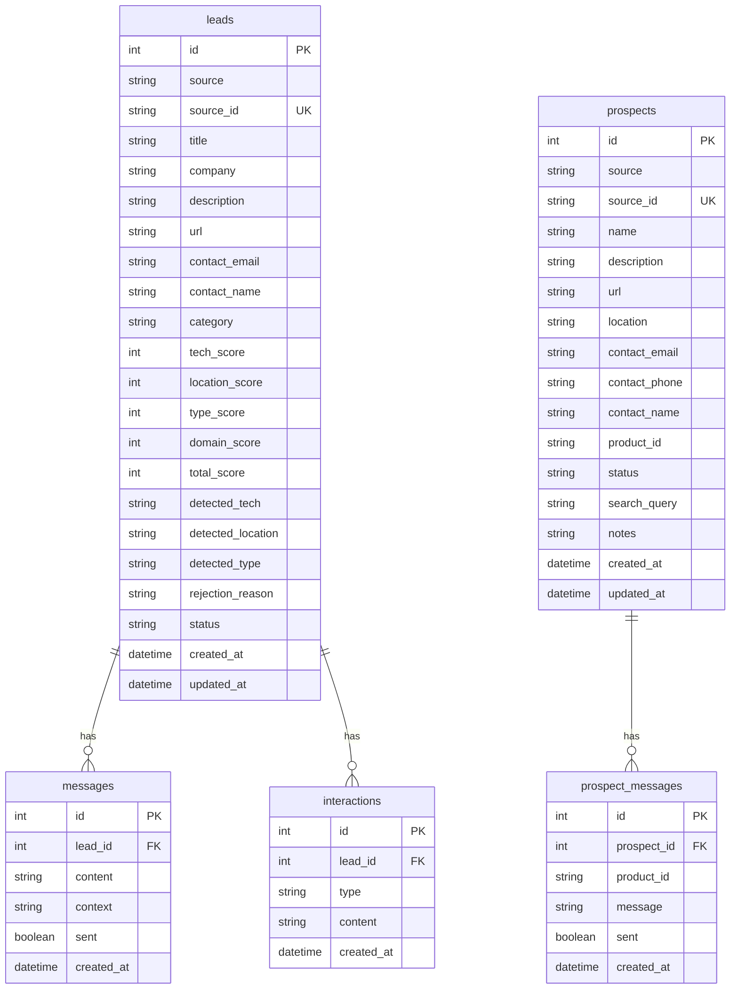

# LeadHunter - Documentacion Completa

## 1. Overview

### Que hace
CRM para busqueda de trabajo freelance y prospeccion de clientes con:
- **Leads**: Scraping automatico de oportunidades freelance desde HackerNews, Reddit y RemoteOK
- **Prospectos**: Busqueda de clientes potenciales via Google/Bing para venderles productos de software
- **AI/RAG**: Clasificacion automatica de leads y generacion de mensajes personalizados con Ollama

### Para quien
Mar Cabrera - Senior Full Stack Developer freelance buscando:
1. Trabajos freelance/contract en .NET, React, Node.js
2. Clientes para vender productos de software propios (ExpensasApp, PilatesGest)

### Problema que resuelve
- Automatiza la busqueda de oportunidades freelance en multiples fuentes
- Filtra automaticamente leads por ubicacion (descarta "US only"), tech stack y tipo de trabajo
- Genera mensajes de aplicacion/venta personalizados con IA
- Busca prospectos para outbound sales con extraccion automatica de emails

---

## 2. Stack Tecnologico

| Categoria | Tecnologia | Version |
|-----------|------------|---------|
| Runtime | Node.js | ESM (type: module) |
| Server | Express.js | 4.21.0 |
| Database | SQLite (better-sqlite3) | 12.5.0 |
| AI/LLM | Ollama (local) | - |
| AI Models | llama3.1:8b, mistral | - |
| HTTP Client | Axios | 1.7.9 |
| HTML Parsing | Cheerio | 1.1.2 |
| Browser Automation | Puppeteer | 24.34.0 |
| Frontend | Vanilla JS + CSS | - |

---

## 3. Arquitectura

### Estructura de Carpetas
```
freelance-crm-v2/
├── data/                      # Datos de configuracion y BD
│   ├── crm.db                 # Base de datos SQLite
│   ├── profile.json           # Perfil del usuario (skills, experiencia)
│   └── products.json          # Productos para vender
├── public/
│   └── index.html             # Frontend SPA completo
├── src/
│   ├── db/
│   │   ├── database.js        # Funciones CRUD para SQLite
│   │   └── init.js            # Script para inicializar/resetear BD
│   ├── rag/
│   │   ├── classifier.js      # Clasificacion de leads por reglas
│   │   ├── classify-leads.js  # Script CLI para reclasificar
│   │   ├── messages.js        # Generacion de mensajes para aplicar a trabajos
│   │   ├── sales-messages.js  # Generacion de mensajes de venta
│   │   └── query-interpreter.js # Interpreta queries con AI
│   ├── scrapers/
│   │   ├── hackernews.js      # Scraper "Who is Hiring"
│   │   ├── reddit.js          # Scraper r/forhire, r/remotejs, etc.
│   │   ├── remoteok.js        # Scraper RemoteOK API
│   │   ├── google-search.js   # Busqueda DuckDuckGo + Bing + filtro AI
│   │   ├── contact-extractor.js # Extraccion de emails/telefonos
│   │   ├── prospect-search.js # Orquestador de busqueda de prospectos
│   │   ├── utils.js           # Helpers (fetch con retry, delay)
│   │   └── run-all.js         # Ejecuta todos los scrapers
│   └── server.js              # API REST Express
└── package.json
```

### Patrones
- **Single Page Application**: Frontend en un solo HTML con vanilla JS
- **REST API**: Express con endpoints para CRUD de leads y prospectos
- **Scraping Pipeline**: Scraper -> Classifier -> Database
- **AI Pipeline**: Query -> Interpreter -> Search -> Filter -> Results

### Flujo de Datos

#### Leads (Inbound - buscar trabajo)
```
Scrapers (HN, Reddit, RemoteOK)
    ↓
Classifier (reglas de scoring)
    ↓
Database (leads table)
    ↓
Frontend (ver, filtrar, contactar)
    ↓
AI Message Generator (Ollama/mistral)
```

#### Prospectos (Outbound - vender productos)
```
User Query ("consorcio")
    ↓
AI Query Interpreter (llama3.1)
    ↓
Search (DuckDuckGo + Bing)
    ↓
AI Filter (filtrar directorios)
    ↓
Email Extractor (Cheerio)
    ↓
Database (prospects table)
    ↓
AI Sales Message Generator (Ollama/mistral)
```

---

## 4. Modelo de Datos

### Diagrama ER (Mermaid)


### Tablas

#### leads
| Campo | Tipo | Descripcion |
|-------|------|-------------|
| id | INTEGER | Primary key |
| source | TEXT | hackernews, reddit, remoteok, manual |
| source_id | TEXT | ID unico de la fuente |
| title | TEXT | Titulo del post/job |
| company | TEXT | Nombre de la empresa |
| description | TEXT | Descripcion completa |
| url | TEXT | Link original |
| contact_email | TEXT | Email extraido |
| category | TEXT | freelance_direct, agency, fulltime_backup, outbound_opportunity, discarded |
| tech_score | INTEGER | 0-50, matcheo de tecnologias |
| location_score | INTEGER | -100 a 20, penaliza US-only |
| type_score | INTEGER | 0-25, bonus para freelance/contract |
| domain_score | INTEGER | 0-15, matcheo de dominio |
| total_score | INTEGER | Suma de scores, 0-100 |
| status | TEXT | new, contacted, responded, discarded |

#### prospects
| Campo | Tipo | Descripcion |
|-------|------|-------------|
| id | INTEGER | Primary key |
| source | TEXT | google_search, manual |
| source_id | TEXT | URL o ID unico |
| name | TEXT | Nombre del negocio |
| description | TEXT | Descripcion |
| url | TEXT | Website |
| location | TEXT | Ubicacion buscada |
| contact_email | TEXT | Email extraido |
| contact_phone | TEXT | Telefono extraido |
| product_id | TEXT | expensas, pilates (producto a vender) |
| status | TEXT | new, contacted, responded, converted, discarded |
| search_query | TEXT | Query original de busqueda |
| notes | TEXT | Notas del usuario |

---

## 5. Funcionalidades

### Tab: Leads (Inbound)

#### Scraping de Fuentes
- **HackerNews**: Thread mensual "Who is Hiring", extrae comentarios
- **Reddit**: r/forhire, r/remotejs, r/dotnet, r/reactjs, r/freelance, r/webdev
- **RemoteOK**: API JSON de trabajos remotos

#### Clasificacion Automatica
El sistema clasifica cada lead en:
- **A: Freelance Directo** - Empresas buscando contractors, aceptan LATAM/remote
- **B: Agencias** - Plataformas tipo Toptal, Turing, etc.
- **D: Full-time Backup** - Para considerar despues
- **X: Discarded** - US-only, sin tech relevante, roles de leadership

#### Scoring (0-100)
- **Tech Score (0-50)**: Core tech (+15 c/u), secondary tech (+5 c/u)
- **Location Score (-100 a +20)**: "US only" = -100 descarte. "Remote/LATAM" = +20
- **Type Score (0-25)**: Freelance/contract = +25, Fulltime = +5
- **Domain Score (0-15)**: Matcheo de dominios (healthcare, logistics, etc.)

#### Generacion de Mensajes
Usa Ollama/Mistral para generar mensajes de aplicacion:
- Analiza job description y detecta necesidad principal
- Selecciona experiencia/proyecto mas relevante
- Genera mensaje de 50-60 palabras, directo, sin "I'm excited"

### Tab: Prospectos (Outbound)

#### Busqueda de Prospectos
1. Usuario escribe query ("consorcio", "pilates")
2. AI interpreta y mejora query ("administracion de consorcios")
3. Busca en DuckDuckGo + Bing
4. AI filtra directorios (solo deja negocios reales)
5. Extrae emails/telefonos de las webs

#### Productos Configurados
- **ExpensasApp**: Sistema de gestion de expensas para consorcios
- **PilatesGest**: Sistema de turnos para estudios de pilates

#### Generacion de Mensajes de Venta
Genera mensajes personalizados de 50-80 palabras:
- Menciona algo especifico del prospecto
- Presenta UN beneficio clave del producto
- Termina con pregunta que invite a responder

---

## 6. APIs

### Leads

| Metodo | Endpoint | Descripcion |
|--------|----------|-------------|
| GET | `/api/leads` | Lista leads con filtros (category, status, minScore, search, hasEmail) |
| GET | `/api/leads/:id` | Obtiene un lead |
| PATCH | `/api/leads/:id` | Actualiza campos de un lead |
| PATCH | `/api/leads/:id/status` | Cambia status |
| PATCH | `/api/leads/:id/category` | Cambia categoria |
| DELETE | `/api/leads/:id` | Elimina lead |
| POST | `/api/leads/:id/reclassify` | Reclasifica un lead |
| POST | `/api/leads/:id/generate-message` | Genera mensaje con AI |
| GET | `/api/leads/:id/messages` | Lista mensajes generados |
| PATCH | `/api/messages/:id/sent` | Marca mensaje como enviado |
| POST | `/api/leads/:id/interactions` | Agrega interaccion |
| GET | `/api/leads/:id/interactions` | Lista interacciones |

### Prospectos

| Metodo | Endpoint | Descripcion |
|--------|----------|-------------|
| POST | `/api/prospects/search` | Busca prospectos en Google (body: query, location) |
| POST | `/api/prospects/match-product` | Matchea query con producto sin buscar |
| POST | `/api/prospects` | Guarda un prospecto |
| GET | `/api/prospects` | Lista prospectos guardados |
| GET | `/api/prospects/:id` | Obtiene un prospecto |
| PATCH | `/api/prospects/:id` | Actualiza prospecto |
| DELETE | `/api/prospects/:id` | Elimina prospecto |
| POST | `/api/prospects/:id/generate-message` | Genera mensaje de venta |
| POST | `/api/prospects/:id/improve-message` | Mejora mensaje existente con feedback |
| GET | `/api/prospects/:id/messages` | Lista mensajes |
| PATCH | `/api/prospect-messages/:id/sent` | Marca mensaje de prospecto como enviado |
| POST | `/api/prospects/extract-email` | Extrae email de una URL |
| GET | `/api/prospects/stats` | Estadisticas de prospectos |

### Otros

| Metodo | Endpoint | Descripcion |
|--------|----------|-------------|
| POST | `/api/scrape` | Ejecuta todos los scrapers |
| GET | `/api/stats` | Estadisticas generales |
| GET | `/api/sources` | Lista fuentes disponibles |
| POST | `/api/reclassify-all` | Reclasifica todos los leads |
| GET | `/api/ollama/status` | Verifica si Ollama esta corriendo |
| GET | `/api/products` | Lista productos configurados |
| GET | `/api/products/:id` | Obtiene un producto |
| POST | `/api/outbound` | Agrega oportunidad outbound manual |
| POST | `/api/messages/improve` | Mejora un mensaje existente |

---

## 7. Configuracion

Toda la configuracion se realiza desde la UI en la tab "Configuracion". No se requieren archivos `.env`.

### Servicios Externos

#### Ollama (Requerido)
LLM local para generacion de mensajes con IA.
- URL por defecto: `http://localhost:11434`
- Modelos soportados: `mistral`, `llama3.1:8b`, `llama3.2`
- Instalacion:
  ```bash
  ollama serve
  ollama pull mistral
  ollama pull llama3.1:8b
  ```

#### Google Custom Search API (Opcional)
Mejora la calidad de busqueda de prospectos. Sin configurar, usa DuckDuckGo + Bing.

**Limite**: 100 busquedas gratis por dia.

**Como obtener credenciales:**

1. **API Key**:
   - Ir a [Google Cloud Console](https://console.cloud.google.com)
   - Crear proyecto o seleccionar uno existente
   - Buscar y habilitar "Custom Search API"
   - Ir a Credentials > Create Credentials > API Key

2. **Search Engine ID (CX)**:
   - Ir a [Programmable Search Engine](https://programmablesearchengine.google.com)
   - Crear motor de busqueda > "Buscar en toda la web"
   - Copiar el Search Engine ID

3. **Configurar en la UI**:
   - Ir a la tab "Configuracion" en la app
   - Ingresar API Key y CX
   - Clic en "Guardar configuracion"

### Archivo de Configuracion

La configuracion se guarda en `data/config.json`:
```json
{
  "google": {
    "apiKey": "",
    "cx": ""
  },
  "ollama": {
    "url": "http://localhost:11434",
    "model": "mistral"
  }
}
```

### APIs de Configuracion

| Metodo | Endpoint | Descripcion |
|--------|----------|-------------|
| GET | `/api/config` | Obtiene config actual (API keys parcialmente ocultas) |
| POST | `/api/config` | Guarda configuracion |
| GET | `/api/config/test-google` | Prueba conexion con Google API |

### Archivos de Datos

#### data/config.json
Configuracion del sistema (se edita desde la UI):
- `google.apiKey`, `google.cx`: Credenciales de Google Custom Search
- `ollama.url`, `ollama.model`: Configuracion de Ollama

#### data/profile.json
Perfil del usuario con:
- Datos personales (nombre, email, portfolio, linkedin)
- `core_tech`: Tecnologias principales que matchean alto
- `secondary_tech`: Tecnologias secundarias
- `domains`: Dominios de experiencia (healthcare, logistics, etc.)
- `experience_summary`: Historial laboral para contexto de mensajes
- `projects`: Proyectos personales
- `looking_for`: Preferencias de trabajo (remote, LATAM, rate)

#### data/products.json
Productos para vender con:
- `id`: Identificador
- `name`, `short_name`, `description`
- `keywords`: Para matchear queries de busqueda
- `search_queries`: Queries optimizados para Google
- `value_prop`, `target_audience`
- `features`, `pain_points`

---

## 8. Como Correrlo

### Instalacion
```bash
git clone https://github.com/mxrcabrera/freelance-crm.git
cd freelance-crm
npm install
```

### Inicializar Base de Datos
```bash
npm run db:init
```

### Correr Ollama (en otra terminal)
```bash
ollama serve
# Primera vez: descargar modelos
ollama pull llama3.1:8b
ollama pull mistral
```

### Iniciar Servidor
```bash
npm start
# Abre http://localhost:3000
```

### Ejecutar Scrapers
```bash
# Todos los scrapers
npm run scrape

# Individual
npm run scrape:hn      # HackerNews
npm run scrape:reddit  # Reddit
npm run scrape:remoteok # RemoteOK
```

### Reclasificar Leads
```bash
npm run classify
```

---

## 9. Estado Actual

### Implementado
- [x] Scraping de HackerNews, Reddit, RemoteOK
- [x] Clasificacion automatica de leads con scoring
- [x] Descarte de leads US-only, leadership roles
- [x] Generacion de mensajes con AI (Ollama/Mistral)
- [x] CRUD completo de leads
- [x] Busqueda de prospectos (DuckDuckGo + Bing)
- [x] Filtro AI para descartar directorios
- [x] Interprete de queries con AI ("consorcio" -> "administracion de consorcios")
- [x] Extraccion de emails/telefonos de webs
- [x] Generacion de mensajes de venta
- [x] UI completa con tabs (Leads / Prospectos)
- [x] Status tracking (new, contacted, responded)

### Falta / Por mejorar
- [ ] Follow-up automatico de mensajes (funcion `generateFollowUpMessage` existe pero no integrada en API)
- [ ] Exportar leads/prospectos a CSV
- [ ] Dashboard con metricas mas detalladas
- [ ] Integracion con email (enviar desde la app)
- [ ] Integracion con WhatsApp Business API
- [ ] Scheduler para scraping automatico (cron)
- [ ] Tests unitarios/integracion
- [ ] Autenticacion (actualmente es local-only)

---

## Comandos Utiles

```bash
# Ver logs del servidor
npm start

# Reset de base de datos
npm run db:init

# Buscar prospecto via API
curl -X POST http://localhost:3000/api/prospects/search \
  -H "Content-Type: application/json" \
  -d '{"query": "veterinaria", "location": "Buenos Aires"}'

# Agregar oportunidad outbound manual
curl -X POST http://localhost:3000/api/outbound \
  -H "Content-Type: application/json" \
  -d '{"title":"Startup X","company":"Startup X","description":"Building a logistics platform...","url":"https://..."}'
```
